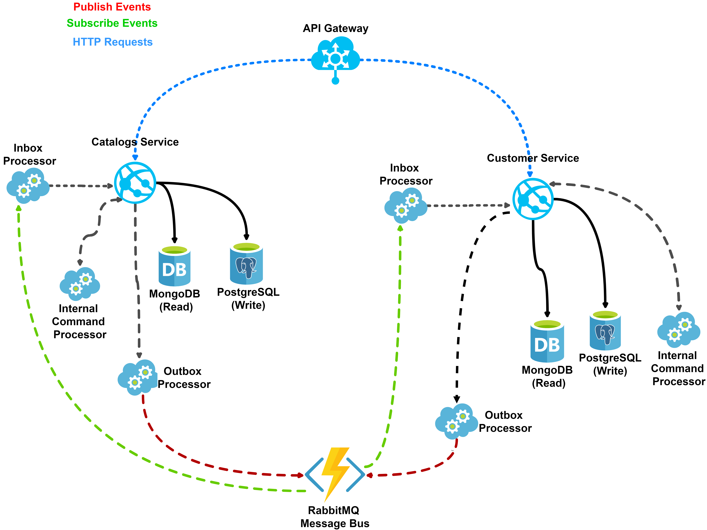
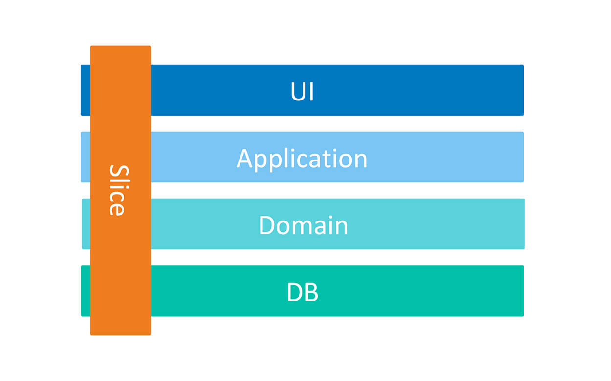
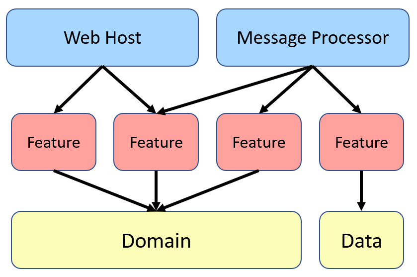

# 🍔 Spring Food Delivery Microservices

[](http://commitizen.github.io/cz-cli/)

[](https://codespaces.new/mehdihadeli/spring-food-delivery-microservices)

> `Spring Food Delivery Microservices` is a fictional food delivery microservices, built with .Net Core and different software architecture and technologies like **Microservices Architecture**, **Vertical Slice Architecture** , **CQRS Pattern**, **Domain Driven Design (DDD)**, **Event Driven Architecture**. For communication between independent services, we use asynchronous messaging with using rabbitmq on top of `spring amqp`, and sometimes we use synchronous communication for real-time communications with using REST calls.

> [!NOTE]
> This application is not `business oriented` and my focus is mostly on technical part, I just want to implement a sample with using different technologies, software architecture design, principles and all the thing we need for creating a microservices app.

> [!WARNING]  
> This project is in progress. I add new features over the time. You can check the [Release Notes](https://github.com/mehdihadeli/spring-food-delivery-microservices/releases).

> [!IMPORTANT]
> Other versions of this project like golang and .net are available in these repositories:
>
> - [https://github.com/mehdihadeli/go-food-delivery-microservices](https://github.com/mehdihadeli/go-food-delivery-microservices)
> - [https://github.com/mehdihadeli/food-delivery-microservices](https://github.com/mehdihadeli/food-delivery-microservices)
> - [https://github.com/mehdihadeli/food-delivery-modular-monolith](https://github.com/mehdihadeli/food-delivery-modular-monolith)

## ⭐ Support

If you like feel free to ⭐ this repository, It helps out :)

Thanks a bunch for supporting me!

## Table of Contents

- [🍔 Spring Food Delivery Microservices](#-spring-food-delivery-microservices)
  - [⭐ Support](#-support)
  - [Table of Contents](#table-of-contents)
  - [Features](#features)
  - [Plan](#plan)
  - [Technologies - Libraries](#technologies---libraries)
  - [The Domain And Bounded Context - Service Boundary](#the-domain-and-bounded-context---service-boundary)
  - [Application Architecture](#application-architecture)
  - [Application Structure](#application-structure)
    - [High Level Structure](#high-level-structure)
  - [How to Run](#how-to-run)
  - [Contribution](#contribution)
  - [Project References](#project-references)
  - [License](#license)

## Features

- ✅ Using Spring MVC as a Web Framework.
- ✅ Using `Microservices` and `Vertical Slice Architecture` as a high level architecture
- ✅ Using `Event Driven Architecture` on top of RabbitMQ Message Broker and `Spring AMQP` library
- ✅ Using `Domain Driven Design`in most of services like Customers, Catalogs, ...
- ✅ Using `CQRS Pattern` on top of `java-mediator` package and splitting `read models` and `write models`
- ✅ Using `Structured logging` with `slf4j` and `log4j2` and using `Console Appender` to write logs to the console and `OpenTelemetryAppender` to send logs to `grafana loki` and `kibana`
- ✅ Using `Outbox Pattern` for all microservices for [Guaranteed Delivery](https://www.enterpriseintegrationpatterns.com/GuaranteedMessaging.html) or [At-least-once Delivery](https://www.cloudcomputingpatterns.org/at_least_once_delivery/)
- ✅ Using `Inbox Pattern` for handling [Idempotency](https://www.cloudcomputingpatterns.org/idempotent_processor/) in reciver side and [Exactly-once Delivery](https://www.cloudcomputingpatterns.org/exactly_once_delivery/)
- ✅ Using `Fluent Validation` and `Spring Validation` and [Validation Pipeline Behavior](./building-blocks/src/main/java/com/github/mehdihadeli/buildingblocks/validation/ValidationPipelineBehavior.java) on top of `java-mediator` package
- ✅ Using `Postgres` on top of `Spring Data JPA` for write database as relational DB and `MongoDB` on top of `Spring Data MongoDB` for read database
- ✅ Using `docker` and `docker-compose` for deployment
- ✅ Using [Spring Cloud Gateway](https://docs.spring.io/spring-cloud-gateway/reference/) as reverse proxy and API Gateway
- ✅ Using different type of tests like `Unit Tests`, `Integration Tests`, `End-To-End Tests` and [testcontainers](https://microsoft.github.io/reverse-proxy/) for testing in isolation
- ✅ Using [OpenTelemetry Spring Boot starter](https://github.com/open-telemetry/opentelemetry-java-instrumentation/tree/main/instrumentation/spring/starters/spring-boot-starter) which collects some packages from [open-telemetry/opentelemetry-java-instrumentation/](https://github.com/open-telemetry/opentelemetry-java-instrumentation/) and [open-telemetry/opentelemetry-java](https://github.com/open-telemetry/opentelemetry-java) to collect `Logs`, `Metrics` and `Traces` and sending telemetry data to different exporters like prometheus, tempo, loki, jaeger, kibana through [opentelemetry collector](https://opentelemetry.io/docs/collector/) and showing them in grafana dashboard
- ✅ Using `Unit Testing` for testing small units and mocking our dependencies with `Mockito`.
- ✅ Using `End-To-End Testing` and `Integration Testing` for testing features with all dependencies using `testcontainers`.
- ✅ Using [Springdoc Openapi](https://springdoc.org/) for generating OpenAPI documentation in Spring Boot.

## Plan

> This project is in progress, new features will be added over time.

| Feature          | Architecture Pattern | Status         | CI-CD |
| ---------------- | -------------------- | -------------- | ----- |
| Building Blocks  | -                    | ✅ Completed   | -     |
| API Gateway      | -                    | ✅ Completed   | -     |
| Catalogs Service | -                    | ✅ Completed   | -     |
| Identity Service | -                    | ❌ Not Started | -     |
| Customer Service | -                    | ❌ Not Started | -     |
| Order Service    | -                    | ❌ Not Started | -     |

## Technologies - Libraries

- ✔️ **[Spring Boot](https://github.com/spring-projects/spring-boot)** - Framework for building Java applications with pre-configured defaults and embedded server support.
- ✔️ **[Spring-Cloud-Gateway](https://github.com/spring-cloud/spring-cloud-gateway)** - An API Gateway built on Spring Framework and Spring Boot providing routing and more.
- ✔️ **[Spring AMQP](https://github.com/spring-projects/spring-amqp)** - Simplifies messaging using RabbitMQ with declarative configuration and templates.
- ✔️ **[Spring Data JPA](https://github.com/spring-projects/spring-data-jpa)** - Enhances JPA with repository abstractions and advanced query capabilities.
- ✔️ **[Spring Data MongoDB](https://github.com/spring-projects/spring-data-mongodb)** - Provides seamless MongoDB integration with Spring-based applications.
- ✔️ **[Spring Security](https://github.com/spring-projects/spring-security)** - Comprehensive security framework for authentication and authorization in Java applications.
- ✔️ **[Springdoc OpenAPI](https://github.com/springdoc/springdoc-openapi)** - Automatically generates OpenAPI 3 documentation for Spring Boot projects.
- ✔️ **[Swagger Core](https://github.com/swagger-api/swagger-core)** - Core library for building and consuming Swagger-compliant APIs.
- ✔️ **[Opentelemetry-Java](https://github.com/open-telemetry/opentelemetry-java)** - OpenTelemetry Java SDK and using its [BOM](https://github.com/open-telemetry/opentelemetry-java/tree/main/bom).
- ✔️ **[Opentelemetry-Java-Instrumentation](https://github.com/open-telemetry/opentelemetry-java-instrumentation)** - OpenTelemetry auto-instrumentation and instrumentation libraries for Java and using its [BOM](https://github.com/open-telemetry/opentelemetry-java-instrumentation/tree/main/bom).
- ✔️ **[OpenTelemetry Collector](https://opentelemetry.io/docs/collector/)** - Vendor-agnostic way to receive, process and export telemetry data.
- ✔️ **[Flyway](https://github.com/flyway/flyway)** - Database migration tool for version-controlled and repeatable schema changes.
- ✔️ **[JPA Buddy](https://jpa-buddy.com)** - Productivity tool for working with JPA and Hibernate, simplifying development and debugging.
- ✔️ **[ULID Creator](https://github.com/f4b6a3/ulid-creator)** - Library for generating UUIDs in various formats and versions.
- ✔️ **[QueryDSL](https://github.com/querydsl/querydsl)** - Enables type-safe queries for JPA, SQL, and other persistence layers.
- ✔️ **[Testcontainers](https://github.com/testcontainers/testcontainers-java)** - Provides lightweight, disposable Docker containers for testing purposes.
- ✔️ **[Mockito](https://github.com/mockito/mockito)** - Popular mocking framework for writing clean, maintainable unit tests in Java.
- ✔️ **[JUnit](https://github.com/junit-team)** - Essential testing framework for Java developers, supporting unit and integration testing.
- ✔️ **[Rest-Assured](https://github.com/rest-assured/rest-assured)** - Java DSL for easy testing of REST services.
- ✔️ **[Spotbugs](https://github.com/spotbugs/spotbugs)** - SpotBugs is FindBugs' successor. A tool for static analysis to look for bugs in Java code.
- ✔️ **[Mapstruct](https://github.com/mapstruct/mapstruct)** - An annotation processor for generating type-safe bean mappers.
- ✔️ **[Wiremock](https://github.com/wiremock/wiremock)** - A tool for mocking HTTP services.
- ✔️ **[Datafaker](https://github.com/datafaker-net/datafaker)** - Generating fake data for the JVM (Java, Kotlin, Groovy) has never been easier!
- ✔️ **[Guava](https://github.com/google/guava)** - Google core libraries for Java.
- ✔️ **[Hibernate-Metamodel-Generator](https://github.com/hibernate/hibernate-orm/tree/main/tooling/metamodel-generator)** - Annotation Processor to generate JPA 2 static metamodel classes.
- ✔️ **[Spotless](https://github.com/diffplug/spotless)** - Keep your code spotless.
- ✔️ **[Palantir-Java-Format](https://github.com/palantir/palantir-java-format)** - A modern, lambda-friendly, 120 character Java formatter.

## The Domain And Bounded Context - Service Boundary

TODO

## Application Architecture

The bellow architecture shows that there is one public API (API Gateway) which is accessible for the clients and this is done via HTTP request/response. The API gateway then routes the HTTP request to the corresponding microservice. The HTTP request is received by the microservice that hosts its own REST API. Each microservice is running within its own `AppDomain` and has directly access to its own dependencies such as databases, files, local transaction, etc. All these dependencies are only accessible for that microservice and not to the outside world. In fact microservices are decoupled from each other and are autonomous. This also means that the microservice does not rely on other parts in the system and can run independently of other services.



Microservices are [event based](https://event-driven.io/en/internal_external_events/) which means they can publish and/or subscribe to any events occurring in the setup. By using this approach for communicating between services, each microservice does not need to know about the other services or handle errors occurred in other microservices.

In this architecture we use [CQRS Pattern](https://www.kurrent.io/cqrs-pattern) for separating read and write model beside of other [CQRS Advantages](https://youtu.be/dK4Yb6-LxAk?t=1029). Here for now I don't use [Event Sourcing](https://www.kurrent.io/blog/event-sourcing-and-cqrs) for simplicity but I will use it in future for syncing read and write side with sending streams and using [Projection Feature](https://event-driven.io/en/projections_and_read_models_in_event_driven_architecture/) for some subscribers to syncing their data through sent streams and creating our [Custom Read Models](https://codeopinion.com/projections-in-event-sourcing-build-any-model-you-want/) in subscribers side.

Here I have a write model that uses a postgres database for handling better `Consistency` and `ACID Transaction` guaranty. beside o this write side I use a read side model that uses MongoDB for better performance of our read side without any joins with using some nested documents, also better scalability with some good scaling features in MongoDB.

For syncing our read side and write side we have 2 options with using Event Driven Architecture (without using events streams in event sourcing):

- If our `read sides` are in `same service`, during saving data in write side and in the same transaction, we save a [Internal Command](https://github.com/kgrzybek/modular-monolith-with-ddd#38-internal-processing) record in our [PersistMessage](./building-blocks/src/main/java/com/github/mehdihadeli/buildingblocks/jpamessagepersistence/PostgresMessagePersistenceRepositoryImpl.java) storage (like something we do in outbox pattern) and after committing write side, our [MessagePersistenceBackgroundService](./building-blocks/src/main/java/com/github/mehdihadeli/buildingblocks/core/messaging/messagepersistence/MessagePersistenceBackgroundService.java) and [MessagePersistenceServiceImpl](./building-blocks/src/main/java/com/github/mehdihadeli/buildingblocks/core/messaging/messagepersistence/MessagePersistenceServiceImpl.java) reads unsent internal commands and sends them to their corresponding `internal command handlers` in same service and these handlers can save their read models in our
  MongoDb database as a read side.

- If our `read sides` are in `another services` we publish an [integration event](https://event-driven.io/en/internal_external_events/) (with saving this message in the outbox) after committing our write side, all of our `subscribers` or `consumers` can get these events and save them in their read models (MongoDB).

All of these are optional in a application and we should only use what the service requires, For example, if the service does not need to use DDD because the business logic is very simple, and it is mostly `CRUD` we can use `data centric` architecture or If our application is not `Task based` instead of CQRS and separating read side and write side, we can just use a simple `CRUD` based approach.

Here I used [Outbox](http://www.kamilgrzybek.com/design/the-outbox-pattern/) for [Guaranteed Delivery](https://www.enterpriseintegrationpatterns.com/patterns/messaging/GuaranteedMessaging.html) and can be used as a landing zone for integration events before they are published to the message broker.

[Outbox pattern](https://event-driven.io/en/outbox_inbox_patterns_and_delivery_guarantees_explained/) ensures that a message was sent (e.g. to a queue) successfully at least once. With this pattern, instead of directly publishing a message to the queue, we put it in the temporary storage (e.g. database table) for preventing missing any message and some retry mechanism in any failure ([At-least-once Delivery](https://www.cloudcomputingpatterns.org/at_least_once_delivery/)). For example When we save data as part of one transaction in our service, we also save messages (Integration Events) that we want to process later in another microservices. The list of messages to be processed is called a [PersistMessage](./building-blocks/src/main/java/com/github/mehdihadeli/buildingblocks/abstractions/core/messaging/messagepersistence/PersistMessage.java) with a [MessageDeliveryType](./building-blocks/src/main/java/com/github/mehdihadeli/buildingblocks/abstractions/core/messaging/messagepersistence/MessageDeliveryType.java) which can be `Outbox`, `Inbox` and `InternalCommand` and a [MessageStatus](./building-blocks/src/main/java/com/github/mehdihadeli/buildingblocks/abstractions/core/messaging/messagepersistence/MessageStatus.java) which can be `Stored` and `Delivered`. The [MessagePersistenceService](./building-blocks/src/main/java/com/github/mehdihadeli/buildingblocks/abstractions/core/messaging/messagepersistence/MessagePersistenceService.java) service is responsible for doing this message processing internally.

Also we have a background service [MessagePersistenceBackgroundService](./building-blocks/src/main/java/com/github/mehdihadeli/buildingblocks/core/messaging/messagepersistence/MessagePersistenceBackgroundService.java) that periodically checks the our [PersistMessages](./building-blocks//src/main/java/com/github/mehdihadeli/buildingblocks/abstractions/core/messaging/messagepersistence/PersistMessage.java) in the database and try to send the messages to the broker with using our [MessagePersistenceService](./building-blocks/src/main/java/com/github/mehdihadeli/buildingblocks/abstractions/core/messaging/messagepersistence/MessagePersistenceService.java) service. After it gets confirmation of publishing (e.g. ACK from the broker) it marks the message as processed to avoid `resending` and `duplication`.
However, it is possible that we will not be able to mark the message as processed due to communication error, for example `broker` is `unavailable`. In this case our [MessagePersistenceBackgroundService](./building-blocks/src/main/java/com/github/mehdihadeli/buildingblocks/core/messaging/messagepersistence/MessagePersistenceBackgroundService.jav) try to resend the messages that not processed and it is actually [At-Least-Once delivery](http://www.cloudcomputingpatterns.org/at_least_once_delivery/). We can be sure that message will be sent `once`, but can be sent `multiple times` too! That’s why another name for this approach is Once-Or-More delivery. We should remember this and try to design receivers of our messages as [Idempotents](https://www.enterpriseintegrationpatterns.com/patterns/messaging/IdempotentReceiver.html), which means:

> A message that has the same effect whether it is received once or multiple times. This means that a message can safely be resent without causing any problems even if the receiver receives duplicates of the same message.

For handling [Idempotency](https://www.enterpriseintegrationpatterns.com/patterns/messaging/IdempotentReceiver.html) and [Exactly-once Delivery](https://www.cloudcomputingpatterns.org/exactly_once_delivery/) in consumers side, we can use [Inbox Pattern](https://event-driven.io/en/outbox_inbox_patterns_and_delivery_guarantees_explained/).

This pattern is similar to Outbox Pattern. It’s used to handle incoming messages (e.g. from a queue) for `unique processing` of `a single message` only `once` (even with executing multiple time). Accordingly, we have a table in which we’re storing incoming messages. Contrary to outbox pattern, we first save the messages in the database, then we’re returning ACK to queue. If save succeeded, but we didn’t return ACK to queue, then delivery will be retried. That’s why we have at-least-once delivery again. After that, an `inbox background process` runs and will process the inbox messages that not processed yet. also we can prevent executing a message with specific `MessgaeId`multiple times. after executing our inbox message for example with calling our subscribed event handlers we send a ACK to the queue when they succeeded. (Inbox part of the system is in progress, I will cover this part soon as possible)

Also here I used `RabbitMQ` as my `Message Broker` for my async communication between the microservices with using eventually consistency mechanism, for now I used [Spring AMQP](https://docs.spring.io/spring-amqp/reference/) for handling event driven communications. beside of using eventually consistency through event driven architecture we have a synchronous calls with using `REST` when we need immediate consistency.

I used [Spring Cloud Gateway](https://docs.spring.io/spring-cloud-gateway/reference/) which is an `API Gateway` built on top of the Spring as reverse proxy (we can use envoy, traefik, nginx, ...), in front of our services. We can also have multiple Api Gateways for reaching `BFF pattern`. For example one Gateway for mobile apps, One Gateway for web apps and etc.
With using api Gateway our internal microservices are transparent and user can not access them directly and all requests will serve through this Gateway.
Also we can use gateway for load balancing, authentication and authorization, caching ,...

## Application Structure

In this project I used [vertical slice architecture](https://jimmybogard.com/vertical-slice-architecture/) or [Restructuring to a Vertical Slice Architecture](https://codeopinion.com/restructuring-to-a-vertical-slice-architecture/) also I used [feature folder structure](http://www.kamilgrzybek.com/design/feature-folders/) in this project.

- We treat each request as a distinct use case or slice, encapsulating and grouping all concerns from front-end to back.
- When We adding or changing a feature in an application in n-tire architecture, we are typically touching many different "layers" in an application. we are changing the user interface, adding fields to models, modifying validation, and so on. Instead of coupling across a layer, we couple vertically along a slice and each change affects only one slice.
- We `Minimize coupling` `between slices`, and `maximize coupling` `in a slice`.
- With this approach, each of our vertical slices can decide for itself how to best fulfill the request. New features only add code, we're not changing shared code and worrying about side effects. For implementing vertical slice architecture using cqrs pattern is a good match.





Also here I used [CQRS](https://www.eventecommerce.com/cqrs-pattern) for decompose my features to very small parts that makes our application:

- maximize performance, scalability and simplicity.
- adding new feature to this mechanism is very easy without any breaking change in other part of our codes. New features only add code, we're not changing shared code and worrying about side effects.
- easy to maintain and any changes only affect on one command or query (or a slice) and avoid any breaking changes on other parts
- it gives us better separation of concerns and cross cutting concern (with help of MediatR behavior pipelines) in our code instead of a big service class for doing a lot of things.

With using [CQRS](https://event-driven.io/en/cqrs_facts_and_myths_explained/), our code will be more aligned with [SOLID principles](https://en.wikipedia.org/wiki/SOLID), especially with:

- [Single Responsibility](https://en.wikipedia.org/wiki/Single-responsibility_principle) rule - because logic responsible for a given operation is enclosed in its own type.
- [Open-Closed](https://en.wikipedia.org/wiki/Open%E2%80%93closed_principle) rule - because to add new operation you don’t need to edit any of the existing types, instead you need to add a new file with a new type representing that operation.

Here instead of some [Technical Splitting](http://www.kamilgrzybek.com/design/feature-folders/) for example a folder or layer for our `services`, `controllers` and `data models` which increase dependencies between our technical splitting and also jump between layers or folders, We cut each business functionality into some vertical slices, and inner each of these slices we have [Technical Folders Structure](http://www.kamilgrzybek.com/design/feature-folders/) specific to that feature (command, handlers, infrastructure, repository, controllers, data models, ...).

Usually, when we work on a given functionality we need some technical things for example:

- API endpoint (Controller)
- Request Input (Dto)
- Request Output (Dto)
- Some class to handle Request, For example Command and Command Handler or Query and Query Handler
- Data Model

Now we could all of these things beside each other and it decrease jumping and dependencies between some layers or folders.

Keeping such a split works great with CQRS. It segregates our operations and slices the application code vertically instead of horizontally. In Our CQRS pattern each command/query handler is a separate slice. This is where you can reduce coupling between layers. Each handler can be a separated code unit, even copy/pasted. Thanks to that, we can tune down the specific method to not follow general conventions (e.g. use custom SQL query or even different storage). In a traditional layered architecture, when we change the core generic mechanism in one layer, it can impact all methods.

### High Level Structure

TODO

## How to Run

Run the [docker-compose.infrastructure.yaml](deployments/docker-compose/docker-compose.infrastructure.yaml) file in the root of project, for running required infrastructures to run microservices with bellow command:

```bash
docker-compose -f ./deployments/docker-compose/docker-compose.infrastructure.yaml up -d
```

Now we can run our microservices with using `mvn` and `make` command and some predefined commands in our [Makefile](./Makefile):

**Run Services:**

```bash
# run catalogs
make run-catalogs

# run api-gateway
make run-api-gateway
```

**Build Services:**

```bash
# build catalogs
make build-catalogs

# build api-gateway
make build-api-gateway

# build-all services
make build-all
```

**Test Services:**

```bash
# test catalogs
make test-catalogs

# test api-gateway
make test-api-gateway

# test-all services
make test-all
```

**Install Services:**

```bash
# install catalogs
make install-catalogs

# install api-gateway
make install-api-gateway

# install-all services
make install-all
```

Some useful commands with using `make` and `mvn`:

```bash
# Clean all microservices
make clean-all

# check style rules with spotless
make check-spotless

# apply style rules with spotless
make apply-spotless
```

## Contribution

The application is in development status. You are feel free to submit pull request or create the issue.

## Project References

- [https://github.com/oskardudycz/EventSourcing.NetCore](https://github.com/oskardudycz/EventSourcing.NetCore)
- [https://github.com/oskardudycz/slim-down-your-aggregate](https://github.com/oskardudycz/slim-down-your-aggregate)

## License

The project is under [MIT license](https://github.com/mehdihadeli/spring-food-delivery-microservices/blob/main/LICENSE).
